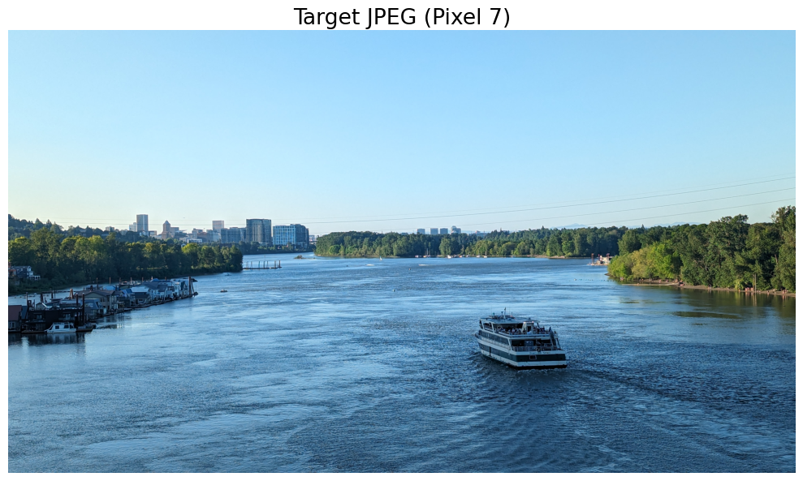
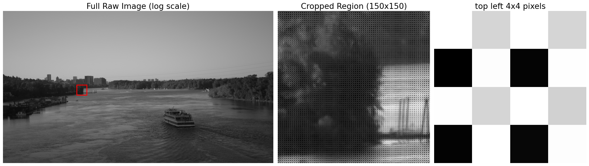
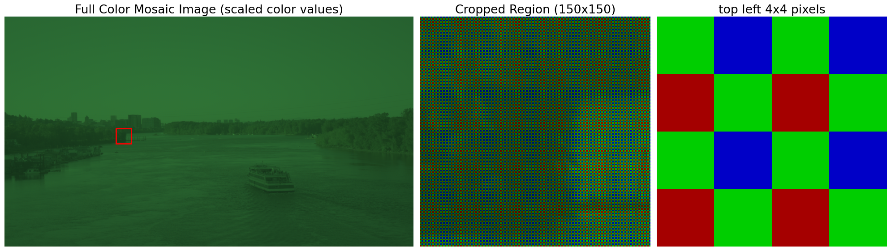

> **🚧 Disclaimer:** *This project and blog post are currently a Work in Progress (WIP). The repository code, models, and explanations are actively being developed and refined!*

# How to Reverse Engineer Your Camera’s ISP using PyTorch

## Project in Brief
**OpenTorchISP** is a differentiable camera pipeline designed to automate color grading and reverse-engineer proprietary camera rendering styles.

* **The Core:** A custom PyTorch implementation of a standard Image Signal Processor (ISP) pipeline, including Demosaicing, White Balance, Color Correction Matrices (CCM), 1D Look-Up Tables (LUTs), and Lens Shading Correction (LSC).
* **The Method:** Uses gradient descent to optimize these explicit parameters, minimizing the perceptual difference between a RAW input and a reference JPEG.
* **The Result:** A lightweight, interpretable model that can "clone" the look of a specific camera or edit, enabling automated high-fidelity color matching without heavy neural networks.

## Introduction

Ever taken a photo of a scene that looked beautiful in real life but terrible on your screen? Blown-out skies, crushed shadows, weird tints? That’s because your camera’s ISP made decisions you didn't ask for. It took the sensor data, cooked it, compressed it, and served you a JPEG you can’t really fix.

But what if we could go back to the source? What if we could build our own ISP in Python to "clone" the look of a pro camera or create our own color science from scratch?

<p align='center'>
  
</p>
<p align='center'>
    <i>A beautiful image captured from Portland's Sellwood bridge (using a Google Pixel 7). Your camera sensor does not capture this scene as is. The camera ISP pipeline that ensures your images don't look crappy is even more beautiful than this scene. Trust me!</i>
</p>

### The RAW Image

What do we mean by a RAW image, and how is it different from a JPEG? A JPEG is like a restaurant meal: cooked, seasoned, and plated. You can’t un-cook the steak or take the salt out of the soup.

A RAW file is the bag of groceries. It’s the raw sensor data—unprocessed, dark, and ugly—but it holds all the potential.

<p align='center'>
  
</p>
<p align='center'>
    <i>Figure 2 - The raw image captured by the sensor is not colored. The sensor only records the intensity of incident light. Why do we see a checkerboard pattern as we zoom into the raw image?</i>
</p>


### How do I load and view a raw image?

Open-source libraries like [rawpy](https://letmaik.github.io/rawpy/api/rawpy.RawPy.html) can be used to read the raw image data directly from `.dng` files. Here is a code snippet you can use:

```python
import rawpy
import numpy as np

DNG_PATH = "your_image.dng"

with rawpy.imread(DNG_PATH) as raw:
    # Bayer mosaic (2D)
    bayer = raw.raw_image_visible.copy().astype(np.float32)
    H, W = bayer.shape

    # Black / white levels
    black = raw.black_level_per_channel
    white = raw.white_level

    # Bayer pattern
    # raw.raw_pattern gives 2x2 mapping of channels: 0=R, 1=G, 2=B, 3=G2
    pattern = raw.raw_pattern.copy()

    # Camera WB multipliers (if exists)
    cam_wb = raw.camera_whitebalance
```


Sometimes the `color_desc` might return an empty string, but the `raw_pattern` gives us the exact 2x2 grid of the camera's Color Filter Array (CFA).

Using the CFA pattern, we can determine which color filter was used for each pixel and then obtain a colored version of the raw image, which is known as a **mosaiced image**.

> **💡 Note:** We don't have to guess the layout! In our output, `raw_pattern` returned `[[3 2], [0 1]]`. In `rawpy`, the numbers map to colors: `0=Red`, `1=Green`, `2=Blue`, and `3=Green` (the second green). If we read this 2x2 grid from left-to-right and top-to-bottom, we get **G**reen, **B**lue, **R**ed, **G**reen. This tells us precisely that our sensor uses a **GBRG** Bayer pattern!

<p align='center'>

</p>
<p align='center'>
<i>Figure 3 - Mosaiced image obtained after extracting the CFA information from the .dng image. Notice the heavy green tint; this is because most CFA patterns use twice as many pixels to capture green light than red or blue light to mimic human vision.</i>
</p>

---

## References

*(To be added)*

